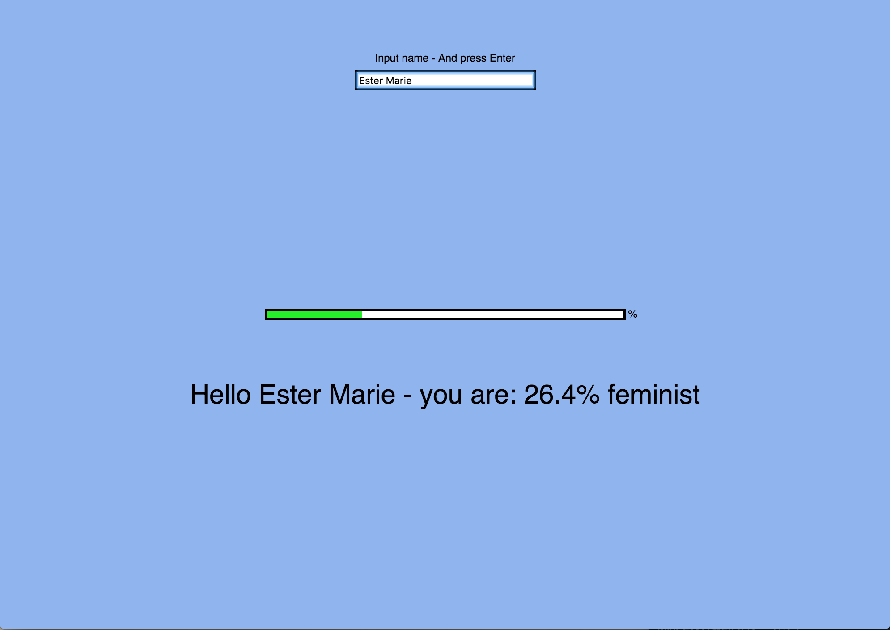

# Mini exercise 2

### The truth about you 

##### link:
https://estermarieaa.github.io/Mini-exercises/mini_ex2

#### The programming experience

My first intend was to make a completely different program, but is was to difficult to code, so I tried to start over, and think of a new more simple concept. 

In the first program I wanted to make some kind of a game, with a cirtical theme (you/the user had to collect like buttons, meanwhile you would get a lot of dislikes, the goal was to collect enough likes to create a positive amount of likes, but this wouldnt be possible to achieve). 

Since it was'nt possible at this point of my programming experience, I chose to make a program that was critical too, but more simple to code. By making this new program I found out that is was possible to create a awareness of a moral (The one intended from the first game, was used to som extend used in the second program as well) by making a more simple program. That in it self was a interesting epiphany, since it showed me that the skill level of coding doesnt determine wether or not you can present a moral through programming. 

The program consist of a input bar, where the user input his/hers name, whereafter the user presses Enter. Then a random statement "Hello (User name) - You are 66,7% eating pizza tonight", and a bar showing the percentage shows.

I have used som simple shapes, in the form of the rectangles framing the areas that the user can interact with. Apart from that I have made my first "own" function, called EnterPressed, that executes the different things that happens are the user has input his/hers name. Creating your own function makes the program easier to read, and it lets me execute a group of things at the same time. 

Apart from that I have tried to be more aware of the visual part of my code, like commenting on the different parts, space between different functions and so on. So it is easier for others to read the code. 

"Emphasizing and exploring the multiple scales
of fun in computing creates conditions in which forms of critical, political and
collective expression of desiring fun can be seen and given voice." (Fun and software, page 8)

The program tries to challenge ones need to define who or what you are. An example is the ongoing debate about feminism, where it is often expected of people to take a stand, and know how much of a feminist they are, or how much of a socialist they are ect. Apart from the themes that involve the public debates, I have added notions like, how red you are, how oblivoius you are, how true you are and so on. The definitions are a very broad mix, this is to try and illustrate how (i observe) random peoples definition of oneself is. You are expected to take a stand, know what you are, and if you dont know you just say something. Something that is possibly not well thought through. Sometimes you might use cybermind (Searching for answers on the web) to try and define yourself in a hurry, but you dont have the time to be critical. The expectation of you knowing what you stand for, and who you are, plus the loss of the time to be critical creates a random function in the real world, that chooses what people stand for. Know instead of figuring out on your own, you can use the program "What you really are" to get an answer. Using programming to create this critique can in itself be experienced as a notion of fun, since it changes the normal use of programming. Apart from that that program is kind of absurd, and some of the statements a really irrelevant an trivial which creates a sarcastic humour within the program. 

 

