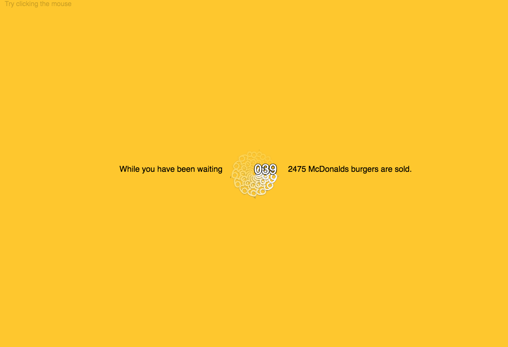
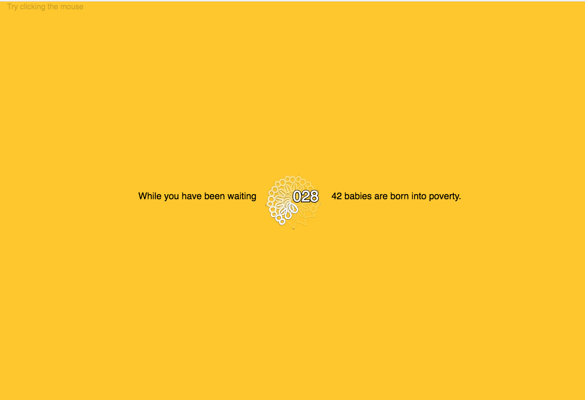

# Mini exercise 3

### While you been waiting

##### link:
https://estermarieaa.github.io/Mini-exercises/mini_ex3

#### The programming experience

##### Describe about your throbber design, both conceptually and technically.

Technically the throbber works by a clock continously counting the seconds from the program starts (and you start waiting). This is shown as an animation, where there is a static text showing the seconds, meanwhile the same text is rotating around in a circle creating a symbol/animation you know from many throbber formats. Beside the text "while you been waiting" is shown. If you click the mouse a statement, showing how many times something has happened in the seconds the user has been waiting. This works by the current amount of seconds the user has been waiting, divided by 5 ( since the statements I found was for every 5 seconds), multiplied by the number, and then combined with the text. Therefore I have made 2 arrays, one with the number, so it was possible to multiply them with the seconds, and one array with the statements. 

Conceptually, the throbber is supposed to make you realise all that is happening while you are waiting. It creates (for me anyways) a feeling of stress, I'm am just waiting, not doing any good, but while I'm "waisting" my time a lot of bad things or good things a happening. 

##### What is the time-related syntax/function that you have used in your program? and why you use in this way?

I have chosen to use seconds as the timerelated syntax. I did this to make it possible to show the statements and the amount of times these have happened. Time in my program is wiewed as something valuable, that you shoulndt waste. 

##### Think about a throbber that you have encounted in digital culture e.g streaming video on YouTube or loading latest feeds on Facebook or waiting a ticket transaction, what do you think a throbber tells us, and/or hides, about? How might we think about this remarkable throbber icon differently?

When I have encountered the throbber I am often annoyed. I have become so used with the speed of everything today, that it is abnormal than things need time to process. I would like to be able to enjoy this waiting time, but I often view this time, as in my program, being wasted. 

A throbber tells us that either something is being processed. Processes we arent able to see are happening. But sometimes a throbber shows, and continues forever, where I have experienced that I just needed to restart the process. In that sence the time is really wasted, because I experience this as a glitch in a program. Therefore I dont always trust in throbbers, because I dont know what is happening while it shows. I would like that the processes happening were more vissible. 

If we should think of the throbber differently, It could be in relation to speed of our lifestyle, that maybe we could introduce the throbber in more aspects of our everyday life, so we are forced to wait, and take the time to wait in the middle of all our plans. 

##### Changes I could have made

If I instead of showing the seconds, showed the milliseconds, and changed the equation. It would still be possible to show the statements about how many times things have happened, but it would be more difficult for the user to calculate how long they have been waiting. When the seconds are showing, it is quite easy for people to figure aout the amount of time they have been waiting. 
