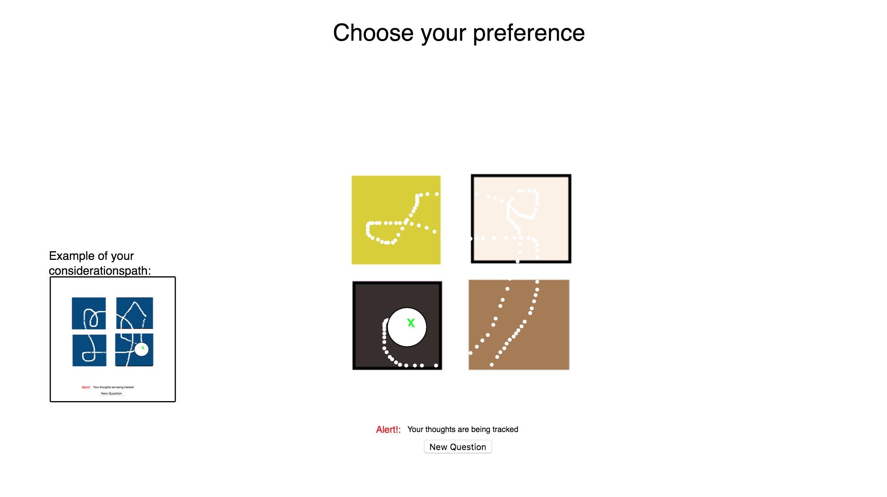
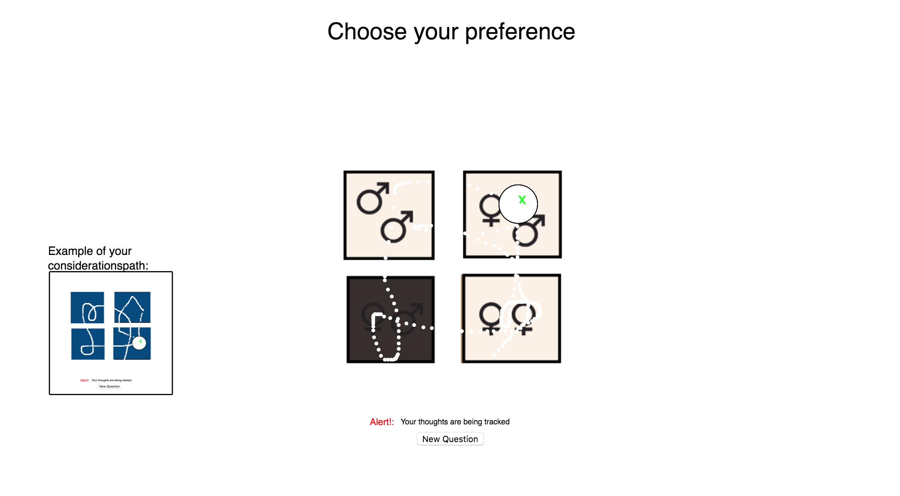

# Mini exercise 4

### pgroman name

##### link:
https://estermarieaa.github.io/Mini-exercises/mini_ex4

#### The programming experience
My first Idea was to make a program that would work as an emotion bank, tracking your facial expression, and then capturing emotions to store them in a form of database. But I wasn't able to make the tracker work on my computer, therefore, I came up with a new idea. But I am sure to experiment with the tracking soon. 

The notion of capture, I made through the way the mouseposition is tracked. The program is very simple and you as a user, only needs to chose preferences between the different things shown on the screen, when you press the button "new question". The moral or the most important part of the program is, that while you are trying to chose a preference your mouseposition is being tracked, drawing a visual painting of your thought pattern, that the computer is able to save. My intuition is that people will follow the mouse around to the different pictures, when trying to decide, and that gives information about the process of consideration that is made while the user choses an answer. 

##### How might this ex helps you to think about or understand the data capturing process in digital culture:
What is interesting is that it is possible  in every program you interact with, that is has a function which tracks the mouse position. So even the things you' ve chosen not to explore, but considered exploring, where the mouse was positioned at that time can give information about your thoughts. Is this data is stored, and you have a way to catogorize all of this data, you can make a very specific profile of people and how they act on the internet. Which i'm sure has been going on for long, but now I have a clearer idea of how it can work. 

##### Changes I could have made

I could have made more questions, so you could interact with the program for alonger time. 

Apart from that I shouldnt have used a random function to chose questions, but just, do as it would take the next one in the array, each time the button was pressed. But when I tried to change something in the function nothing worked for some reason. 

I would have liked to find a way to first show the pattern when the user had chosen one of the pictures, so it would be a more abstract visualization of your thoughst you were presented with. 

