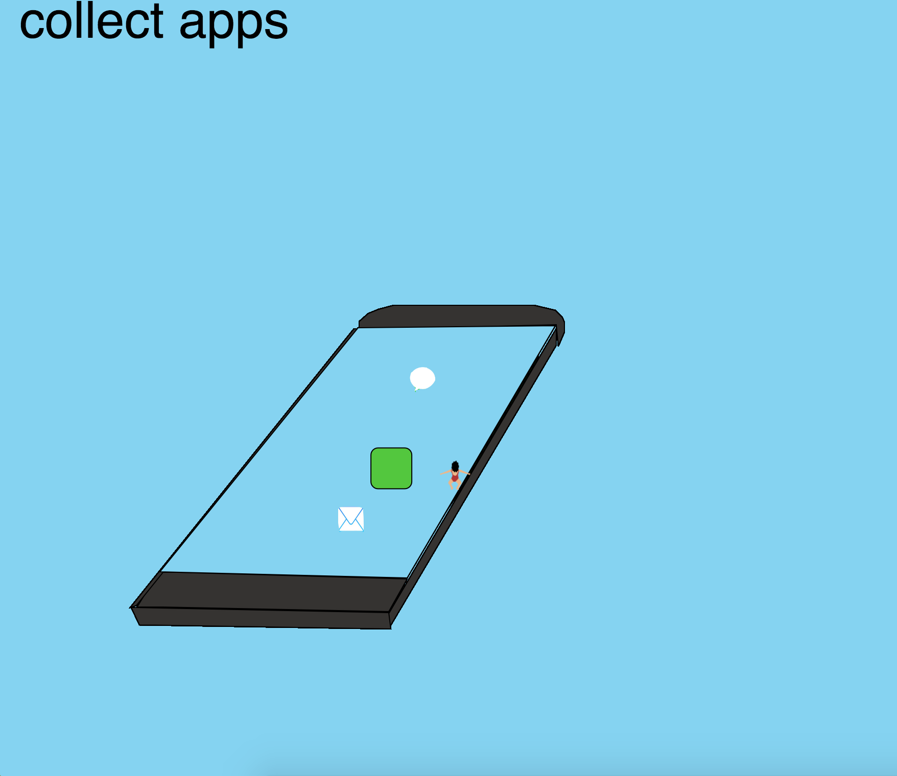

# Mini exercise 5

### App collecter

 (I had problems with the link for the program, so at this link, even though its not showing, there is a video of the program. You just need to click it. )

##### link:
https://estermarieaa.github.io/Mini-exercises/mini_ex5/empty-example/

#### The programming experience
At first my focus was to create a class, which I decided was apps. This class should describe the attributes of an app background, and the another class should describe the foreground. This was quite manageable to do, the difficult part was to draw/show and move the objects, and to create several object using the same class. This took a lot of time and effort, but was very nice when it worked out. Apart from that I had difficulties with implementing images into my program, since it wouldnt identify the path, this was quite nervewrecking since it was impossible to figure out, and then suddenly it worked. This makes me wonder, since the Atom can be a quite "sensitive" program, and you are not always able to figure out where the error is. 

#### Describe how does your game/game object works?
If I had had time to continue working on the game, the purpose was to make a game where the little swimmer animation, was swiming in the iphone pool, trying to collect or avoid different object to create customized apps. 

#### Describe how you program the objects and their related attributes and methods in your game.
I have made to different classes, quite similar to each other, since they should be able to be shown and moved in the same way, they only had to look different. The first class is the background of an app, a rectangle with different colors. The second class is different symbols that we know from our apps as they are, which is images which is called when the objects are made. 

The objects are made using a for loop, where I create an array of different objects with different attributes, color or symbol. A similiar loop is then used to make the objects in the array viseble i the draw function. And show their movement. 

I have made different for loops for each array, but it would probably have been posible to create both the background array and the foreground array of the apps, in the same loop. 

#### Based on Shiftman's videos, Lee's text and in-class lecture, what are the characteristics of object-oriented programming?
I would say that the characteristics of object oriented programming is the attempt to describe something from real life on a one-to-one basis. This means that you chose to describe an object, forexample an apple tree, and then you start from the begginning trying to describe all of its attributes, how it looks, how it moves, how i evolves/grows. This you would in programming define in a class, which makes it possible for you to duplicate and object several times, or make simliar object which different color apples or something like that. It makes it possible to describe the worl down to the simplest detail, it is merely a question of your own thought and time capacity. In this process you create your own abstraction of an object by chosing which attributes to focus on, so  to some extend it becomes a matter of subjectivity. 

#### Extend/connect your game project to wider digital culture context, can you think of a digital example and describe how complex details and operations are being abstracted and encapsulated?
The concept behind my game is an utopian world where the user can costumize his or her apps. I have simplified the concept of the app a lot, by describing it as a app background and a symbol, but it symbolizes eveything from color to source code. 
As a standard user without futher knowledge about software and code, we use predefined and programmed apps, and we are not able to change the attributes of theese apps. This i relate to the obejct oriented programming, since some things a available to the user and some things arent and a choice have been made about what to implement. This makes the user very passive, since they are only able to do something in a specific way, and maybe their behavior is controlled by the way the program is coded, without them even knowing this. It is the programmers abstraction that becomes their reality, and if a small amount of people are able to decide what the world should look like through their abstractions, we are mooving futher and further away from democracy as we know it, since more and more software has a big impact on how we live out lifes.

We see this is many of the social media sites, f. ex when you need to choose gender of your profile and can only chose between two boxes, man or woman. Or maybe in the colorcode of alle the apps and websides we use, the colors are predefined and appeal to different people. So by choosing a specific color to your app, you might chose a specific target group. And so on. 

The reason I chose to use the iphone as a pool and my character a swimmer symbolizes that the user swims "in an ocean of opportunities" - or at least you should as user be able to do so. 

#### Changes I could have made

My plan was to developed my game using p5.play, but I didnt have the time to experiement with this. If I should extend my game I might add a lot of other attributes to the apps, so the user would have even more constructionelements to build their apps from. And the graphics could have been much better. The swimmer was also supposed to be controlled by the keypad instead of the mouse. 

