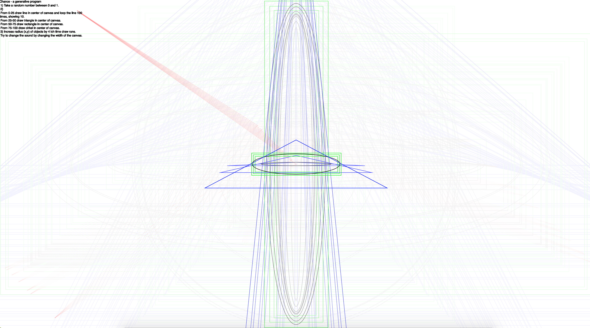
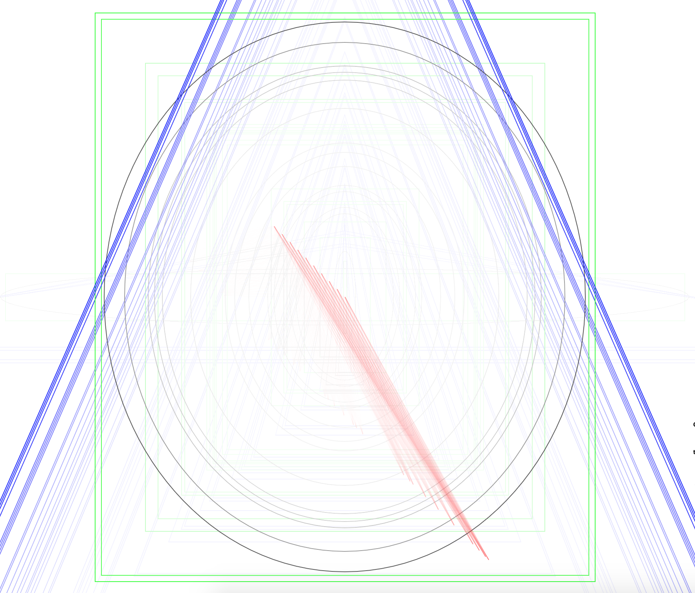

# Mini exercise 6

### Chance - a generative program

##### link:
https://estermarieaa.github.io/Mini-exercises/mini_ex6

#### The programming experience
It was difficult to follow the steps of the mini ex6 assignment. First I just tried to make something generative, and change some parameters of something I already made, and thought I could find som rules from that afterwards. Meybe I could have done this, but I wasnt satisfied with the image, and decided to start over and do as the assigment told. To make som rules on paper, and then try to implement them in a program. This approach I found quite interesting, since it showed me, that a few very simple rules can generate something you wouldnt have imagined. So I made three rules, made a program of them, and was quite quickly satisfied afterwards. 

##### Changes I could have made
Use the for loop in another way. It contributes to the program, but i could have had a bigger effect on the visual if I have used it differently, but I couldnt come up with a way to do it. 

I would have liked to do something with sound, so each kind of object made a controlled a specific sound. 

